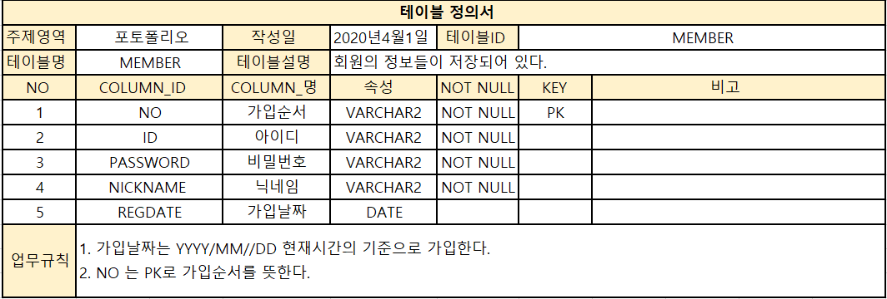
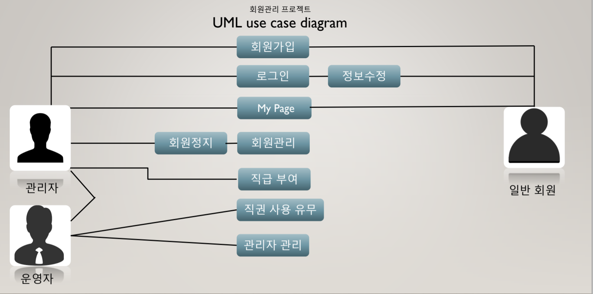

# 개요
● 프로젝트 명 : member-management

● 일정 : 2020.4.1 ~ 2020.4.21

● 팀구성 : 유영규

● 목적 : JSP를 처음 접하면서 JSP에 대한 이해도와 JSP를 사용하면서 프로젝트를 진행하면서 공부함이 목적이다.

● 사용기술 및 개발환경

○ O/S : Windows 10(개발환경)
○ Server : Tomcat8.5
○ DB : Oracle 11g
○ Freamework : JSP, Servlet
○ Programming Language : JAVA, HTML, Javascript
○ Tool : Eclipse

# 목적
● 관리자가 일반 회원들을 관리할 수 있는 있도록 기능 이해

● 운영자가 관리자및 일반 회원들을 관리할 수 있는 기능들 이해 

# 프로젝트 주요 기능
● 회원가입 및 로그인 , 로그아웃 

● 아이디 중복체크 , 회원정보 수정

● 모든 회원정보 보기 , MyPage

● 회원정지 , 회원직급 설정

● 직급순위 변경 , 새로운 직급 추가 

● 직급 사용여부 기능

# 사용 기술 
● JSP, oracle, servlet , java , javascript

# 기술적인 집중 요소 
● 객체지향의 기본원리와 JSP의 기본원리 활용

● MVC 패턴을 이해하며 기본원리를 파악하며 활용

# 테이블정의서

# USECASE

● 운영자 :
            관리자 및 일반회원 관리를 할 수 있다
            모든 회원들의 정보들을 확인 가능하다.

● 관리자 : 
            일반회원을 관리할 수 있으며 일반회원들의 직급과 사용여부를 관리 가능하다. 

● 회원 : 
            로그인을 할 수 있는 기능 

